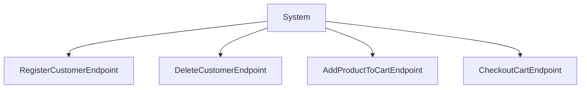
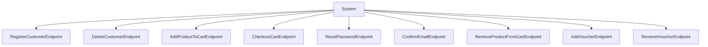
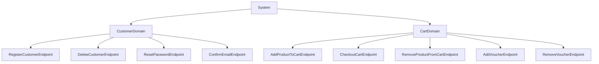
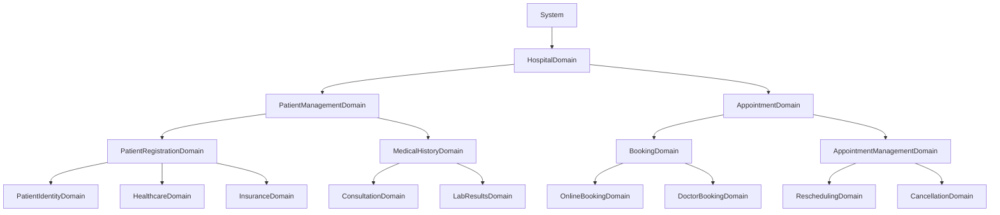

# Architectura - Domains

###### [Architectura](../../README.md) > Domains

This section details the domains system of the Architectura framework.
Specifically this page will give you an overview of the design philosophy around domains.
If you want to get even more information, you can explore the sub-sections.

## Navigation

- [Documentation home](../../README.md)
- [Registering domains](registering_domains.md)

## Table of contents

- [Rationale](#rationale)
- [Domains structure](#domains-structure)
- [How endpoints associate with domains](#how-endpoints-associate-with-domains)

## Rationale

We are convinced that business logic is tightly linked to software development.
It is not possible to develop a solution that meets end-user exceptations without understanding the business logic.
This is not a new concept. It has been explained and detailed as early as 2003 by Eric Evans in his book *Domain-Driven Design: Tackling Complexity in the Heart of Software*.
We are not going to go over the concept of domains in within the Domain Driven Design philosophy. We are simply going to explain how they work within Architectura.

## Domains structure

The most minimal domain would look as follows.

```ts
import { BaseDomain } from "@vitruvius-labs/architectura";

class MyDomain extends BaseDomain
{
	// Add more stuff here!
}

export { MyDomain };
```

This would obviously do nothing on it's own.
The goal of defining domains is to isolate small parts of your application within a specific business logic use-case.

## Examples

So you can understand better what domains are for, let's take a few examples.

### User authentication

In the majority of web solutions, you are going to have an authentication process. This is a good example of how a domain can help you.

#### 1. Creating your UserDomain

Let's start by creating a blank UserDomain.

`user.domain.mts`
```ts
import { BaseDomain } from "@vitruvius-labs/architectura";

class UserDomain extends BaseDomain
{

}

export { UserDomain };
```

#### 2. Registering the domain

Now we will register our domain for Architectura to detect it.

`main.mts`
```ts
import { DomainService, Server } from "@vitruvius-labs/architectura";

await DomainService.LoadMultipleFromRootDirectory(`${import.meta.dirname}/domain`);

const server: Server = await Server.Create({
	https: false,
	port: 80, // This is an example, try to avoid using magic numbers here and rely on configurations or enums.
});

server.start();
```

> [!IMPORTANT]
> Your file name need to contain `.domain.` to be identified by Architectura.

> [!NOTE]
> Unlike endpoints, we encourage you to recursively register your domains. This will help you lessen the required work to add new domains to your solution.

#### 3. Adding endpoints

For this example, we are going to add two endpoints within the `endpoint/` directory next to our `user.domain.mts` file.

The resulting directory structure should look like this.

```
src/
├── domain/
│   └── user/
│       ├── endpoint/
│       │   ├── user-login.endpoint.mts
│       │   └── user-logout.endpoint.mts
│       └── user.domain.mts
└── main.mts
```

The first endpoint will handle user login.

`user-login.endpoint.mts`
```ts
import { type ExecutionContext, HTTPMethodEnum } from "@vitruvius-labs/architectura";
import { BaseEndpoint } from "@vitruvius-labs/architectura";

class UserLoginEndpoint extends BaseEndpoint
{
	protected readonly method: HTTPMethodEnum = HTTPMethodEnum.POST;
	protected readonly route: string = "/user/login";

	public override async execute(context: ExecutionContext): Promise<void>
	{
		// Add your login code here.

		await context.getResponse().text("200 - OK");
	}
}

export { UserLoginEndpoint };
```

The second endpoint will handle user logout.

`user-logout.endpoint.mts`
```ts
import { type ExecutionContext, HTTPMethodEnum } from "@vitruvius-labs/architectura";
import { BaseEndpoint } from "@vitruvius-labs/architectura";

class UserLogoutEndpoint extends BaseEndpoint
{
	protected readonly method: HTTPMethodEnum = HTTPMethodEnum.POST;
	protected readonly route: string = "/user/logout";

	public override async execute(context: ExecutionContext): Promise<void>
	{
		// Add your logout code here.

		await context.getResponse().text("200 - OK");
	}
}

export { UserLogoutEndpoint };
```

#### 4. Registering endpoints at domain level

Now we are going to register our endpoints at the `UserDomain` level.

> [!NOTE]
> By defining your endpoints within your domain, you will guarantee that you know exactly what is being exposed to the internet.
> We **strongly** encourage you not to recursively register endpoints at your application top-level.

`user.domain.mts`
```ts
import { BaseDomain } from "@vitruvius-labs/architectura";

class UserDomain extends BaseDomain
{
	public static override async Initialize(): Promise<void>
	{
		await EndpointRegistry.AddEndpointsDirectory(`${import.meta.dirname}/endpoint`);
	}
}

export { UserDomain };
```

> [!IMPORTANT]
> When found, a domain will automatically call the `Initialize` method. This method is used as a central point to do all your process.
> We recommend you to create more methods within your domain class to keep your code structured and organised.

> [!NOTE]
> At this point, you are ready to start your application. Architectura will automatically register your domain, that will then explicitly register your endpoints.
> Since the `main.mts` file starts the server, both endpoints will become accessible as `POST /user/login` and `POST /user/logout`.

## How endpoints associate with domains

Using purely endpoints has shortcomings. Mainly because this will eventually lead to a situation where it becomes unclear what is where.
This is why Architectura encourages you to separate your business logic among distinct domains.

Let's take the previous diagram again on how endpoints architecture looks like.



If we were to add 5 more endpoints, this structure will look as follows.



It is indeed starting to look confusing, difficult to maintain, and overall not sustainable.

We are going to look at how this would look when separated within domains.



This is starting to look more structured!
If we were to only use one domain level, we would simply postpone the problem we previously exposed.
This is why Architectura supports an infinite nesting of subdomains.



These subdomains helps simplify your logic.
It makes your intent clear for yourself and others.
