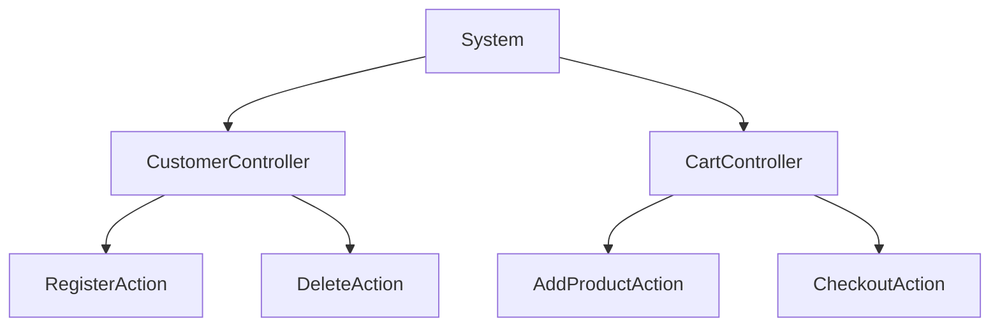
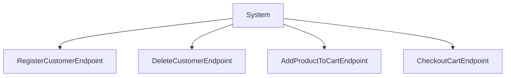
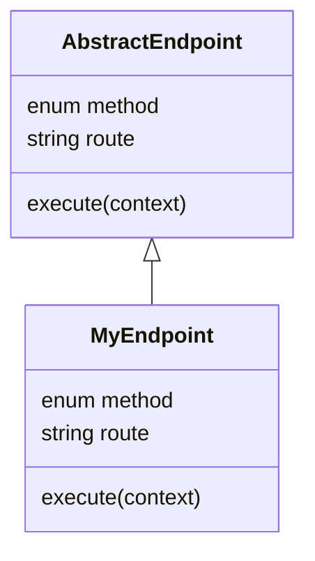

# Architectura - Endpoints

###### [Architectura](../../README.md) > Endpoints

This section details the endpoints system of the Architectura framework.
Specifically this page will give you an overview of the design philosophy around endpoints.
If you want to get even more information, you can explore the sub-sections.

## Navigation

- [Documentation home](../../README.md)
- [Registering endpoints](registering_endpoints.md)
- [Hooks](hooks.md)
- [Execution Context](execution_context.md)

## Table of contents

- [Rationale](#rationale)
- [Endpoint structure](#endpoint-structure)
	- [Self-contained](#self-contained)
	- [Non-ambiguous](#non-ambiguous)

## Rationale

The most common approach to implementing routes tied to actions is to follow the MVC design pattern.

Let's take an example of a simple e-commerce website:



This architecture will lead to problems for multiple reasons:
- You might share code between actions within the same controller. This is not a problem on it's own; however, you might be tempted to store your central code within the controller. If you need to reuse it outside of your controller, this will create a challenge.
- Since you are limited to the scope of your controller, when the number of actions grow, you will start to face new challenges:
	- Your file will become increasingly bigger and difficult to maintain. It is likely for your file to rapidly exceed a 1 000 lines.
		- This might incite you to create a mapping of your actions to external services, increasing cognitive complexity and potentially relying on magic resolution.
	- With a growing number of actions per controller, it will become increasingly more difficult to understand what a controller handles precisely.
- Each action being tied to their controller, their route is implicit. You might not be using strictly the name of the controller as direct route. For example, `CustomerController` would be `/customer` but could also be manually mapped as `/my-customers`. This makes routing more abstract and more difficult to quickly grasp for a newly arrived or more junior developer.

Architectura rejects this approach and propose an endpoint based approach.

Let's take an example for the same e-commerce website with only endpoints (we will see an example with domains right after!):



This software architecture is more streamlined. It allows developers to quickly understand how the code is structured.
There is a notable challenge from this architecture: With time and feature increase, the purely horizontal approach will create a hard to maintain code base.

## Endpoint structure

As a reference, here is a class diagram of how any endpoint works within Architectura.



### Self-contained

As mentioned, an endpoint is self-contained in Architectura.
This means all information necessary to the understanding of a specific endpoint is contained within the file declaring the endpoint.

Let's take an example of a simple endpoint handling a rudimentary application healthcheck:

```ts
import { type ExecutionContext, HTTPMethodEnum } from "@vitruvius-labs/architectura";
import { BaseEndpoint } from "@vitruvius-labs/architectura";

class HealthCheckEndpoint extends BaseEndpoint
{
	protected readonly method: HTTPMethodEnum = HTTPMethodEnum.GET;
	protected readonly route: string = "/health";

	public override async execute(context: ExecutionContext): Promise<void>
	{
		await context.getResponse().text("200 - OK");
	}
}

export { HealthCheckEndpoint };
```

This structure makes the intention clear: We want to run the code within the `execute` method when the `/health` route is called with the `GET` HTTP verb. There is no magic, no ambiguity, no abstraction.

If you were to delete this endpoint, this route would be permanently removed from your application. You wouldn't need to go through a routing file, a controller file to look for the action, and so on. You just need to delete this file and you are done.

This has multiple benefits:
- It makes onboarding developers considerably faster on your application.
- It encourages you to get a more atomic approach to your software by making you consider your endpoint as a single unit of an application rather than a derivate member of a controller.
- It helps you maintain a secure application by giving you full and explicit control over what you expose publicly.

### Non-ambiguous

The endpoints approach reduces ambiguity within your code. Since you are not relying on resolution magic, your intent is clear. As we stated, you want to run the code within the `execute` method when the `/health` route is called with a `GET` HTTP verb.

Reducing ambiguity helps maintaining a clean code base and reduces cognitive load. It allows you to focus on the most important parts of your code base, instead of trying to understand the basics of what you are looking at.
