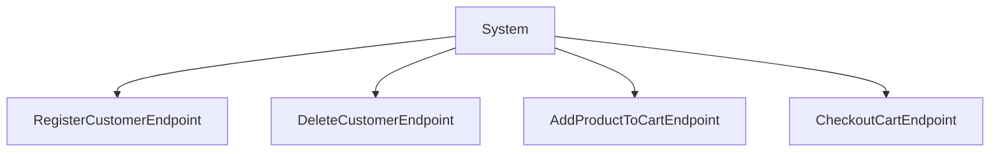
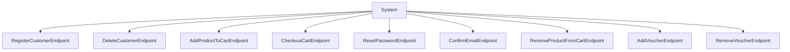
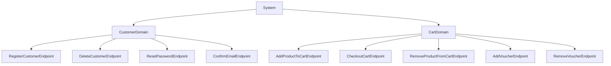

# Architectura - Registering Endpoints

###### [Architectura](../../README.md) > [Endpoints](./readme.md) > Registering Endpoints

This section will help you get started by registering your first endpoints!

## Directory structure

We encourage you to create a directory dedicated to your endpoints (e.g. `endpoint/`).
This is not strictly necessary, but this will help you maintain a comprehensive structure.

## Step-by-step

### 1. Create your endpoint

Let's create a simple endpoint file.

```ts
import { type ExecutionContext, BaseEndpoint, HTTPMethodEnum } from "@vitruvius-labs/architectura";

class HealthCheckEndpoint extends BaseEndpoint
{
	protected readonly method: HTTPMethodEnum = HTTPMethodEnum.GET;
	protected readonly route: string = "/health";

	public override async execute(context: ExecutionContext): Promise<void>
	{
		await context.getResponse().text("200 - OK");
	}
}

export { HealthCheckEndpoint };
```

We are taking our rudimentary healthcheck as an example again.

As you can see, this endpoint inherits from [BaseEndpoint](../../src/core/endpoint/base.endpoint.mts).
This allows Architectura to automatically detect your endpoint when you add the directory containing this file to the registry.

> [!IMPORTANT]
> Your file name need to contain `.endpoint.` to be identified by Architectura.

### 2. Registering your endpoint

Once you have created and saved your file, all you need is the following code.
```ts
import { EndpointRegistry } from "@vitruvius-labs/architectura";

await EndpointRegistry.AddEndpointsDirectory(`${import.meta.dirname}/endpoint`); // Adapt the path to your own needs!
```

It will automatically look for all available endpoints within this directory, recursively.

You can also add your endpoint manually.
```ts
EndpointRegistry.AddEndpoint(HealthCheckEndpoint);
```

### Instance vs constructor

You can either register an endpoint instance or an endpoint constructor.
- If you register an instance, it'll be reused each time and should likely be stateless.
- If you register a constructor, it'll be instantiated each time with no parameter.

It's safer to register them as constructors.

## How endpoints associate with domains

Using purely endpoints has shortcomings.
Mainly because this will eventually lead to a situation where it becomes unclear what is where.
This is why Architectura encourages you to separate your business logic among distinct domains.

Let's take an example of how endpoints architecture may look like.



If we were to add 5 more endpoints, this structure will look as follows.



It is indeed starting to look confusing, difficult to maintain, and overall not sustainable.

We are going to look at how this would look when separated within domains.



This is starting to look more structured!

If we were to only use one domain level, we would simply postpone the problem we previously exposed.
This is why Architectura supports an infinite nesting of subdomains. See [Subdomains](../domains/readme.md#subdomains).
